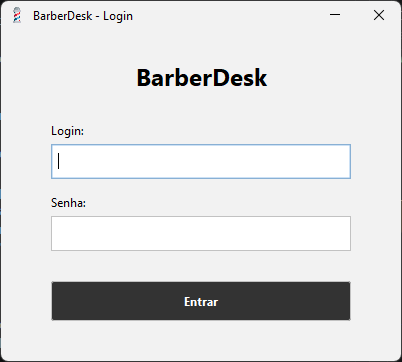
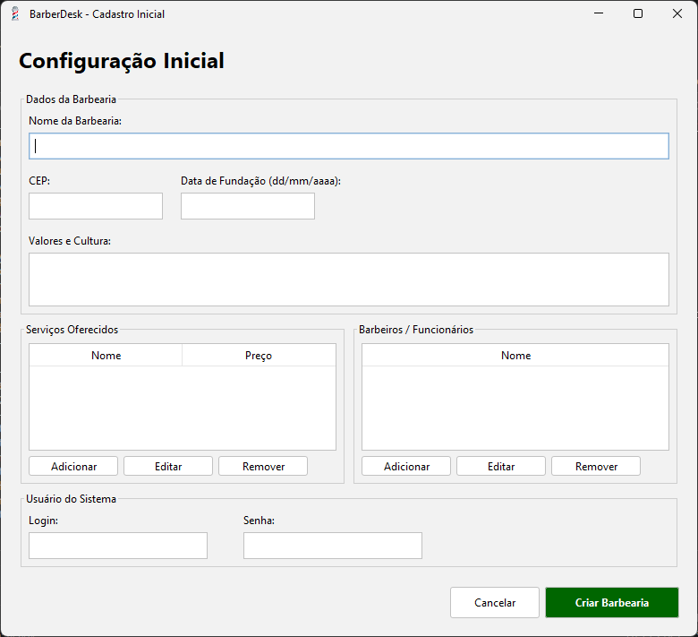
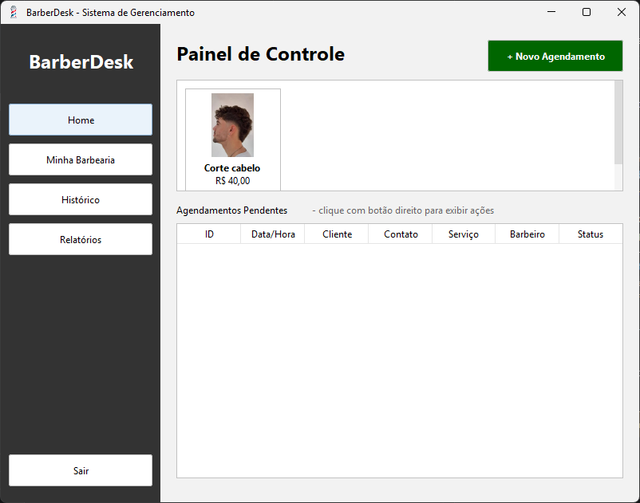
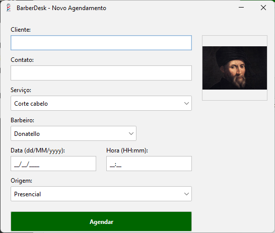
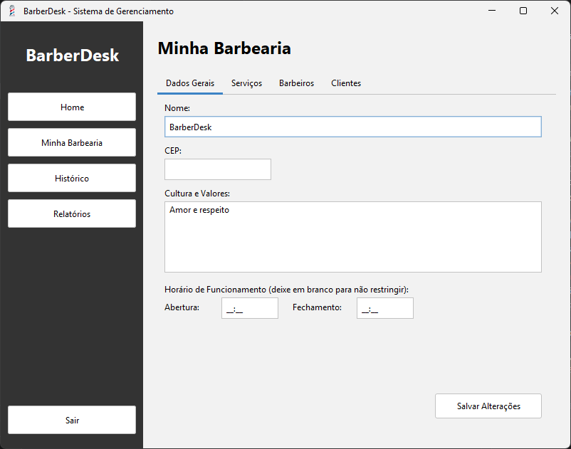
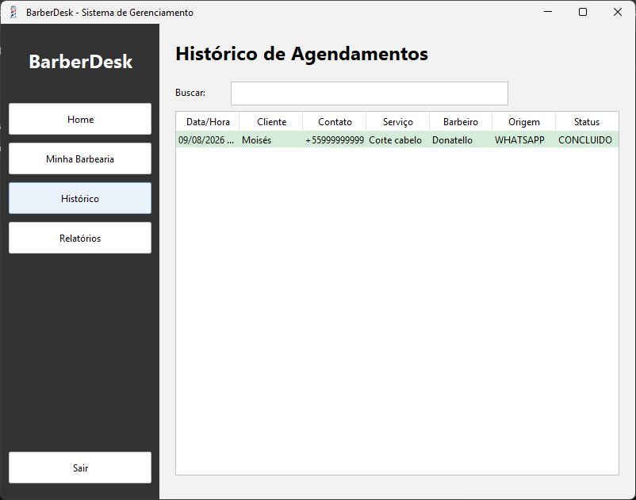
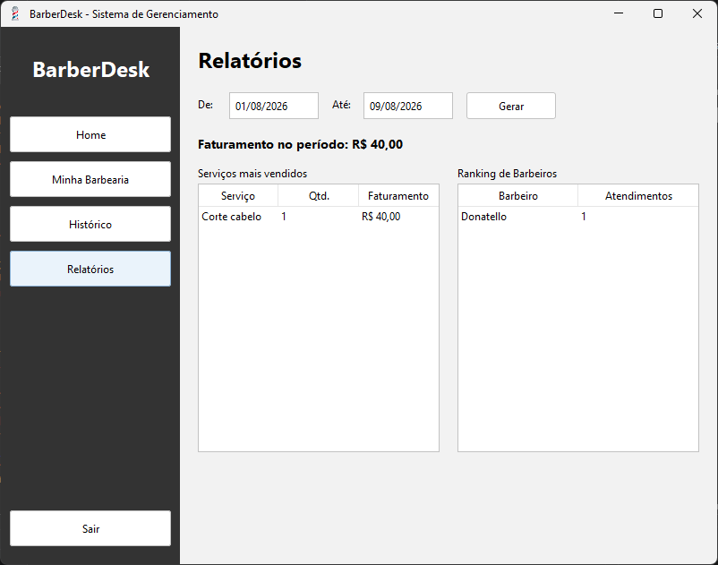

# 💈 barber-shop-desktop - *BarberDesk*

<p align="center">
  <a href="https://github.com/lucas-hochmann-rosa/barber-shop-desktop">
    
  </a>
  <a href="https://www.linkedin.com/in/lucas-hochmann-rosa">
    
  </a>
  <a href="#-tecnologias">
    
  </a>
  <a href="#-tecnologias">
    
  </a>
  <a href="./LICENSE">
    
  </a>
</p>

<p align="center">🇧🇷 Português · <a href="README.en.md">🇺🇸 English</a></p>

> Sistema desktop (Java Swing) para gestão operacional de uma barbearia: cadastro inicial, autenticação, gestão de serviços e barbeiros, e agenda de atendimentos com histórico persistido em MySQL.

---

## ⚡ Início Rápido

```bash
git clone https://github.com/lucas-hochmann-rosa/barber-shop-desktop.git
cd barber-shop-desktop
docker compose up -d          # sobe um MySQL já configurado (veja docker-compose.yml)
mvn clean package
java -jar barbershop-desktop/target/barbershop-desktop-1.0-SNAPSHOT.jar
```

Detalhes de cada passo nas seções abaixo.

---

## 📌 Visão Geral

O **BarberDesk** é uma aplicação desktop (Java Swing) para uso local/rede interna, com foco no controle operacional da barbearia:

- Cadastro inicial da empresa, equipe e serviços.
- Login de acesso com senha em hash salgado (PBKDF2).
- Agendamento com validação de conflito por barbeiro e horário (considerando a duração real do serviço) e de horário de funcionamento.
- Painel Home com agenda pendente, classificada visualmente por status/proximidade, e grid de serviços.
- Histórico completo de atendimentos, com busca.
- Diretório de clientes e dashboard de relatórios (faturamento, serviços mais vendidos, ranking de barbeiros).

---

## 🧠 Funcionalidades

- Fluxo de bootstrap:
  - se não houver barbearia no banco, abre `TelaCadastroInicial`;
  - se já houver cadastro, abre `TelaLogin`.
- Inicialização automática de schema (`DatabaseInitService`) na abertura do app.
- Migrações idempotentes para preservar histórico de agendamentos:
  - snapshots de nome de serviço/barbeiro;
  - remoção de FKs em `agendamentos` para permitir exclusões sem perda de histórico.
- Cadastro inicial completo:
  - dados da barbearia;
  - serviços (nome, preço e imagem opcional);
  - barbeiros (nome e imagem opcional);
  - usuário administrador.
- Login e sessão com contexto de usuário e barbearia.
- Home com:
  - grid de serviços com atalho para novo agendamento;
  - tabela de agendamentos pendentes (`AGENDADO` e `EM_ATENDIMENTO`);
  - menu de contexto para editar, iniciar, concluir e cancelar.
- Tela "Minha Barbearia" para manutenção de:
  - dados gerais;
  - serviços (CRUD);
  - barbeiros (CRUD).
- Histórico de agendamentos com todos os status.
- Cadastro e edição de agendamento com campos:
  - cliente, contato, data/hora, serviço, barbeiro, origem e status.
- Duração configurável por serviço, usada na regra de conflito:
  - bloqueia agendamento do mesmo barbeiro quando os intervalos se sobrepõem de verdade (considerando a duração de cada serviço), não uma janela fixa;
  - permite o mesmo horário para barbeiros diferentes;
  - permite agendamentos "encostados" (um termina exatamente quando o outro começa).
- Horário de funcionamento configurável por barbearia, validado ao criar/editar agendamento.
- Diretório de clientes, populado automaticamente a partir dos agendamentos, com busca.
- Cancelamento de agendamento captura o motivo.
- Atalho para abrir o WhatsApp do cliente a partir do agendamento.
- Classificação visual de agendamentos por status/proximidade do horário (linhas coloridas na tabela).
- Busca/filtro no histórico e no diretório de clientes.
- Tela de Relatórios: faturamento por período, serviços mais vendidos e ranking de barbeiros.
- Fotos de barbeiro/serviço guardadas como Base64 direto no banco - não depende de um arquivo existir num caminho específico do disco.
- Ícone próprio do aplicativo em todas as janelas.
- Logging em arquivo (`~/.barberdesk/logs/`) e pool de conexões com o banco (HikariCP).

---

## 🧭 Sumário

- [Arquitetura](#-arquitetura)
- [Tecnologias](#-tecnologias)
- [Regras de construção do projeto](#-regras-de-construção-do-projeto)
- [Requisitos](#-requisitos)
- [Instalação](#-instalação)
- [Variáveis de Ambiente](#-variáveis-de-ambiente)
- [Execução](#-execução)
- [Deploy (Windows / Linux)](#-deploy-windows--linux)
- [Telas Principais](#-telas-principais)
- [Regras de Negócio](#-regras-de-negócio-implementadas)
- [Adesão aos Requisitos](#-adesão-aos-requisitos-estado-atual)
- [Testes Locais Rápidos](#-testes-locais-rápidos)
- [Verificação do Sistema](#-verificação-do-sistema)
- [Screenshots](#-screenshots)
- [Melhorias Futuras](#-melhorias-futuras)
- [Avisos](#-avisos)
- [Autor](#-autor)
- [Licença](#-licença)

---

## 🏗️ Arquitetura

Projeto **multi-módulo Maven**, dividido para que as regras de negócio (`barbershop-core`) não dependam da interface Swing e possam ser reaproveitadas por uma futura camada Web — ver [`docs/RELATORIO-ETAPA-6.md`](docs/RELATORIO-ETAPA-6.md) para o detalhamento completo dessa separação (princípios SOLID aplicados, *code smells* eliminados, *design patterns* usados).

```text
barber-shop-desktop/
├── pom.xml                             # Módulo pai (agregador): versões centralizadas, sem código
├── nbactions.xml                       # Configuração de execução direta pela IDE NetBeans
├── docker-compose.yml                  # MySQL local já configurado pros defaults do projeto
├── README.md / README.en.md
├── LICENSE
├── docs/
│   ├── RELATORIO-ETAPA-6.md            # SOLID, code smells, design patterns, prontidão pra Web
│   └── screenshots/                    # Prints do sistema usados no README
│
├── barbershop-core/                    # Regras de negócio — sem qualquer dependência de Swing
│   ├── pom.xml
│   └── src/
│       ├── main/java/br/com/barberdesk/
│       │   ├── model/                  # Entidades de domínio (POJOs)
│       │   ├── dao/                    # Acesso a dados (JDBC/MySQL), uma classe por entidade
│       │   │   └── repository/         # Interfaces consumidas pelos services (Repository Pattern)
│       │   ├── service/                # Regras de negócio (agenda, relatórios, setup inicial...)
│       │   └── util/                   # Helpers puros (hash, datas, armazenamento de imagem)
│       ├── main/resources/
│       │   ├── config.properties       # Conexão com o banco (sobrescrevível por env vars)
│       │   └── db/schema.sql           # Schema inicial, criado automaticamente no 1º start
│       └── test/java/br/com/barberdesk/
│           ├── model/, util/           # Testes de lógica pura (hash, datas, equals/hashCode)
│           └── service/                # Testes de service com repositórios fake em memória
│               └── fake/               # Test doubles das interfaces de repositório
│
└── barbershop-desktop/                 # Aplicação Swing — depende de barbershop-core
    ├── pom.xml                         # Gera o jar executável sombreado (maven-shade-plugin)
    └── src/main/
        ├── java/br/com/barberdesk/
        │   ├── app/
        │   │   ├── Main.java             # Ponto de entrada: decide login vs. cadastro inicial
        │   │   ├── FabricaDeServicos.java # Composition root: monta DAOs concretos → services
        │   │   └── VerificacaoSistema.java # Smoke test operacional contra um MySQL real
        │   ├── ui/                        # Telas Swing (NetBeans GUI Builder)
        │   │   ├── controller/            # Lógica de cada área da Home (agenda, catálogo...)
        │   │   └── support/                # Helpers de UI (ícone, máscaras, StatusRowRenderer)
        └── resources/
            ├── logback.xml                # Configuração de log (console + arquivo)
            └── icon.ico
```

### Organização

- **`app/Main.java`**: ponto de entrada e decisão entre cadastro inicial e login.
- **`app/FabricaDeServicos.java`**: único ponto do sistema que instancia DAOs concretos e os injeta nos services via construtor — nenhuma outra classe do módulo desktop deveria instanciar um DAO diretamente.
- **`app/VerificacaoSistema.java`**: utilitário de linha de comando (`main()`) que valida, contra um MySQL real, que conexão, schema, autenticação, agendamento e relatórios continuam funcionando de ponta a ponta — ver [Verificação do Sistema](#-verificação-do-sistema).
- **`service/DatabaseInitService.java`** (delega para `dao/SchemaInitializer.java`): criação de schema e migrações automáticas.
- **`service/AgendaService.java`**: transições de status do agendamento, conflito de horário e validação de horário de funcionamento.
- **`service/RelatorioService.java`** (delega para `dao/RelatorioDAO.java`): agregações para a tela de Relatórios.
- **`dao/`**: camada de acesso MySQL (CRUD e regras de consulta), cada classe implementando uma interface de `dao/repository/`.
- **`ui/TelaHome.java`**: monta a janela e delega cada área (agenda, catálogo, clientes, barbearia, histórico, relatórios) para o controller correspondente em `ui/controller/`.
- **`ui/TelaNovoAgendamento.java`** e **`ui/TelaEditarAgendamento.java`**: fluxo operacional da agenda.

---

## 🛠️ Tecnologias

**Linguagem:** Java 17 (compilação e execução)

**Build:** Maven, multi-módulo (`barbershop-core` + `barbershop-desktop`), versões de dependência centralizadas no `pom.xml` raiz

**Interface:** Java Swing (Look & Feel [FlatLaf](https://www.formdev.com/flatlaf/) `3.4.1`), telas geradas pelo NetBeans GUI Builder (`AbsoluteLayout`)

**Banco de dados:** MySQL 8 + MySQL Connector/J (`mysql-connector-j 8.3.0`), pool de conexões [HikariCP](https://github.com/brettwooldridge/HikariCP) `5.1.0`

**Logging:** SLF4J `2.0.16` + Logback `1.5.16` (console e arquivo)

**Testes:** JUnit 5, com repositórios *fake* em memória para os testes de service (sem dependência de banco real)

**Dev local:** Docker Compose (MySQL)

---

## 📐 Regras de construção do projeto

- Identificadores (classes, métodos, variáveis, tabelas e colunas do banco) ficam em português - é o vocabulário natural do domínio (barbearia, agendamento, barbeiro) e o sistema é feito para uso local/BR.
- Comentários no código ficam reservados para decisões não óbvias - o "porquê", não o "o quê".
- Textos de interface (telas Swing, mensagens ao usuário) ficam sempre em português: é o idioma de quem realmente usa o sistema.
- Nenhuma credencial é commitada: `config.properties` traz apenas defaults de ambiente local (senha vazia), com suporte a sobrescrita por variável de ambiente para outros ambientes.

---

## ⚙️ Requisitos

- JDK 17+
- MySQL ativo e acessível
- Usuário MySQL com permissão para criar/alterar tabelas do schema `barberdesk`
- Maven 3.x (opcional, caso execute pela IDE NetBeans)

---

## 🔧 Instalação

```bash
git clone https://github.com/lucas-hochmann-rosa/barber-shop-desktop.git
cd barber-shop-desktop
```

### 🗄️ Banco de Dados

Opção 1 - Docker Compose (recomendado para desenvolvimento local):

```bash
docker compose up -d
```

Já sobe um MySQL 8 configurado com os defaults de `config.properties` (schema `barberdesk`, usuário `root` sem senha).

Opção 2 - MySQL próprio: crie o banco antes da primeira execução:

```sql
CREATE DATABASE barberdesk;
```

> Em ambas as opções, as tabelas são criadas automaticamente pelo sistema no primeiro start (`barbershop-core/src/main/resources/db/schema.sql`).

---

## 🔐 Variáveis de Ambiente

Você pode configurar a conexão em `barbershop-core/src/main/resources/config.properties`:

```properties
db.url=jdbc:mysql://localhost:3306/barberdesk?useSSL=false&allowPublicKeyRetrieval=true&serverTimezone=America/Sao_Paulo
db.user=root
db.password=
db.driver=com.mysql.cj.jdbc.Driver
```

Ou sobrescrever via variáveis de ambiente:

| Variável | Para que serve |
| --- | --- |
| `DB_URL` | URL JDBC de conexão |
| `DB_USER` | Usuário do MySQL |
| `DB_PASSWORD` | Senha do MySQL |
| `DB_DRIVER` | Driver JDBC (padrão `com.mysql.cj.jdbc.Driver`) |

---

## ▶️ Execução

### Opção 1: NetBeans (recomendada no contexto do projeto)

- Abra o projeto Maven no NetBeans.
- Execute a classe principal `br.com.barberdesk.app.Main`.

### Opção 2: Maven + JAR

```bash
mvn clean package
java -jar barbershop-desktop/target/barbershop-desktop-1.0-SNAPSHOT.jar
```

---

## 📦 Deploy (Windows / Linux)

O projeto não gera instalador nativo (MSI/DEB/RPM) - é um JAR executável multiplataforma via JVM. Empacotar e rodar segue os mesmos passos em qualquer sistema operacional, com pequenas diferenças de comando abaixo.

### 1. Gerar o pacote

```bash
mvn clean package
```

Gera `barbershop-desktop/target/barbershop-desktop-1.0-SNAPSHOT.jar` já com todas as dependências embutidas (`maven-shade-plugin`) - não precisa de mais nada no classpath pra rodar.

### 🪟 Windows

1. **Java**: confira se tem JRE/JDK 17+ instalado (`java -version` no PowerShell/CMD). Se não tiver, baixe o [Eclipse Temurin](https://adoptium.net/) e instale.
2. **Banco de dados**: suba via Docker Compose (`docker compose up -d`, requer Docker Desktop) ou instale o [MySQL Community Server](https://dev.mysql.com/downloads/mysql/) e crie o banco `barberdesk` manualmente.
3. **Executar**:
   ```powershell
   java -jar barbershop-desktop\target\barbershop-desktop-1.0-SNAPSHOT.jar
   ```
4. **Atalho na área de trabalho** (opcional): crie um arquivo `BarberDesk.bat` ao lado do `.jar`:
   ```bat
   @echo off
   start javaw -jar "%~dp0barbershop-desktop-1.0-SNAPSHOT.jar"
   ```
   `javaw` (em vez de `java`) evita abrir uma janela de console junto com a aplicação. Pra trocar o ícone do atalho, aponte-o para `barbershop-desktop/src/main/resources/icon.ico` (já vem pronto no repositório — Windows não aceita `.png` como ícone de atalho).

### 🐧 Linux

1. **Java**: instale um JRE/JDK 17+ pelo gerenciador de pacotes da distro, por exemplo:
   ```bash
   sudo apt install openjdk-17-jre   # Debian/Ubuntu
   sudo dnf install java-17-openjdk  # Fedora
   ```
2. **Banco de dados**: `docker compose up -d` (requer Docker) ou instale o MySQL localmente (`sudo apt install mysql-server`) e crie o banco `barberdesk`.
3. **Executar**:
   ```bash
   java -jar barbershop-desktop/target/barbershop-desktop-1.0-SNAPSHOT.jar
   ```
4. **Launcher `.desktop`** (opcional, pra aparecer no menu de aplicativos):
   ```ini
   [Desktop Entry]
   Name=BarberDesk
   Exec=java -jar /caminho/completo/para/barbershop-desktop-1.0-SNAPSHOT.jar
   Icon=/caminho/completo/para/icon.ico
   Type=Application
   Categories=Office;
   ```
   Salve em `~/.local/share/applications/barberdesk.desktop`.

> Em ambos os sistemas, a aplicação não guarda estado fora do banco - mover o `.jar` de lugar ou trocar de máquina não afeta os dados, desde que `config.properties`/variáveis de ambiente apontem pro MySQL correto (ver [Variáveis de Ambiente](#-variáveis-de-ambiente)).

---

## 🖥️ Telas Principais

| Tela | Objetivo |
| ---- | -------- |
| `TelaCadastroInicial` | Configuração inicial completa da barbearia |
| `TelaLogin` | Autenticação de acesso |
| `TelaHome` | Agenda pendente e atalhos de operação |
| `Minha Barbearia` | Edição de dados gerais, serviços e barbeiros |
| `Histórico` | Visualização de todos os agendamentos, com busca |
| `TelaNovoAgendamento` / `TelaEditarAgendamento` | Cadastro, edição, exclusão e mudança de status |
| `Clientes` (aba em Minha Barbearia) | Diretório de clientes, com busca |
| `Relatórios` | Faturamento, serviços mais vendidos e ranking de barbeiros por período |

---

## 📋 Regras de Negócio (Implementadas)

- Sem barbearia cadastrada: abre cadastro inicial.
- Com barbearia cadastrada: exige login.
- Agendamento exige dados essenciais (cliente, contato, data/hora, serviço, barbeiro e origem).
- Home exibe apenas agendamentos não concluídos.
- Histórico exibe todos os status.
- Conflito por barbeiro considera a duração real do serviço (sobreposição de intervalo, não janela fixa).
- Agendamento fora do horário de funcionamento configurado da barbearia é bloqueado (quando configurado).
- Cancelamento captura o motivo.
- Status suportados:
  - `AGENDADO`
  - `EM_ATENDIMENTO`
  - `CONCLUIDO`
  - `CANCELADO`

---

## 🔎 Adesão aos Requisitos (Estado Atual)

### Requisitos Funcionais

- **RF01**: Permitir cadastro inicial da barbearia com dados básicos, serviços, barbeiros e usuário de acesso.
  **Status**: Implementado.
- **RF02**: Permitir autenticação por meio de login e senha.
  **Status**: Implementado.
- **RF03**: Permitir cadastrar, editar e excluir serviços.
  **Status**: Implementado.
- **RF04**: Permitir cadastrar, editar e excluir barbeiros.
  **Status**: Implementado.
- **RF05**: Permitir criar novo agendamento informando cliente, contato, data/hora, serviço, barbeiro responsável e origem do contato.
  **Status**: Implementado.
- **RF06**: Permitir editar e excluir agendamentos.
  **Status**: Implementado.
- **RF07**: Permitir alterar o status do agendamento (iniciar e concluir atendimento).
  **Status**: Implementado.
- **RF08**: Exibir na Home apenas agendamentos não concluídos.
  **Status**: Implementado.
- **RF09**: Exibir histórico completo de agendamentos, incluindo concluídos.
  **Status**: Implementado.
- **RF10**: Validar conflito de horário apenas quando houver coincidência de data/hora para o mesmo barbeiro.
  **Status**: Implementado com ajuste de regra: o conflito considera a sobreposição real de intervalo (início/fim de cada agendamento, pela duração do serviço) para o mesmo barbeiro, não só a coincidência exata de data/hora.
- **RF11**: Classificar visualmente os agendamentos conforme sua proximidade ou status.
  **Status**: Implementado - linhas coloridas por status e por proximidade do horário (agendamentos a menos de 30 min do início).

### Requisitos Não Funcionais

- **RNF01**: O sistema deverá ser desenvolvido na linguagem Java.
  **Status**: Implementado.
- **RNF02**: O banco de dados utilizado deverá ser MySQL.
  **Status**: Implementado.
- **RNF03**: O sistema será executado como aplicação desktop.
  **Status**: Implementado.
- **RNF04**: O código deverá seguir princípios de orientação a objetos.
  **Status**: Implementado.
- **RNF05**: As informações deverão ser persistidas em banco de dados relacional.
  **Status**: Implementado.
- **RNF06**: O sistema deverá validar campos obrigatórios antes de salvar registros.
  **Status**: Implementado.
- **RNF07**: O acesso ao sistema deverá ser protegido por autenticação básica (login e senha).
  **Status**: Implementado.

---

## 🧪 Testes Locais Rápidos

Há uma suíte de testes automatizados (JUnit 5, 40 testes) rodando na raiz do projeto:

```bash
mvn test
```

Cobre:

- Lógica pura de `model`/`util` (hash de senha, formatação/parse de data, `equals()`/`hashCode()`).
- **Services de negócio** (`AgendaService`, `AuthService`, `RelatorioService`) usando **repositórios *fake* em memória** (`barbershop-core/src/test/java/br/com/barberdesk/service/fake`) — sem tocar em banco real, cobrindo transições de status do agendamento, detecção de conflito de horário, validação de horário de funcionamento e autenticação (incluindo o upgrade silencioso de contas com hash legado).

Não roda contra um banco de verdade nem contra a GUI. Para isso, ver [Verificação do Sistema](#-verificação-do-sistema) (automatizada) e o fluxo manual sugerido abaixo:

1. Iniciar a aplicação sem dados no banco e validar a abertura do cadastro inicial.
2. Criar barbearia + usuário + serviços + barbeiros.
3. Encerrar e validar login.
4. Criar agendamento e validar presença na Home.
5. Tentar conflito (mesmo barbeiro, horário sobreposto considerando a duração do serviço) e validar bloqueio.
6. Alterar status para `EM_ATENDIMENTO` e `CONCLUIDO`; confirmar saída da Home e presença no histórico.
7. Excluir serviço/barbeiro usado e validar histórico preservado (snapshot de nomes).
8. Cancelar um agendamento informando o motivo e conferir que aparece no histórico.
9. Gerar um relatório para um período com agendamentos concluídos.

---

## ✅ Verificação do Sistema

Além dos testes JUnit (que usam repositórios em memória), o projeto tem um smoke test operacional que roda contra um **MySQL real** — útil para validar rapidamente, depois de um deploy ou de uma migração de schema, que o sistema continua funcionando de ponta a ponta:

```bash
docker compose up -d
mvn clean package
java -cp barbershop-desktop/target/barbershop-desktop-1.0-SNAPSHOT.jar br.com.barberdesk.app.VerificacaoSistema
```

Ele conecta no banco, garante o schema, faz um cadastro inicial de verificação, testa autenticação (senha certa e errada), cria um agendamento, confirma a detecção de conflito de horário, cancela o agendamento e gera um relatório — imprimindo `[OK]`/`[FALHA]` para cada checagem:

```
=== BarberDesk — Verificação do Sistema ===

[OK]    Conexão com o banco de dados
[OK]    Schema do banco (migrações)
[OK]    Cadastro inicial (barbearia + usuário + serviço + barbeiro)
[OK]    Autenticação com senha correta
[OK]    Autenticação com senha incorreta é rejeitada
[OK]    Criação de agendamento
[OK]    Conflito de horário é detectado corretamente
[OK]    Cancelamento de agendamento
[OK]    Geração de relatório (faturamento/serviços/ranking)

9 checagem(ns), 0 falha(s).
```

Sai com código `0` se tudo passou, ou `1` se alguma checagem falhou (útil para plugar num pipeline de CI/CD). Todos os dados de verificação criados (barbearia, usuário, serviço, barbeiro, agendamento) são removidos ao final, com sucesso ou falha — não deixa resíduo no banco.

---

## 📸 Screenshots

Prints das telas principais, para referência visual rápida do sistema:

| Login | Cadastro Inicial |
| --- | --- |
|  |  |

| Home (agenda) | Novo agendamento |
| --- | --- |
|  |  |

| Minha Barbearia | Histórico |
| --- | --- |
|  |  |

| Relatórios |
| --- |
|  |

---

## 🚀 Melhorias Futuras

Itens conhecidos e documentados conscientemente como próximos passos, não como descuido:

- **Testes de integração automatizados dos DAOs** contra um MySQL real (ex.: Testcontainers, plugado no `mvn test`) - hoje a cobertura contra banco real é o smoke test manual `VerificacaoSistema` (ver [Verificação do Sistema](#-verificação-do-sistema)), não algo que roda sozinho em CI a cada build.
- **Camada Web**: `barbershop-core` já não depende de Swing (ver [`docs/RELATORIO-ETAPA-6.md`](docs/RELATORIO-ETAPA-6.md)), então está pronto para ser consumido por um novo módulo Web (ex.: Spring Boot) reaproveitando os mesmos services - esse novo módulo ainda não existe.
- **Papéis de usuário**: hoje só existe um admin por barbearia; um barbeiro logado ver só a própria agenda exigiria repensar a relação entre `Usuario` e `Barbeiro`, que hoje não existe.
- **Flyway** no lugar das migrações manuais (`SchemaInitializer`) - adiado por não dar pra validar contra um banco de verdade neste momento.
- **Instalador nativo** via `jpackage`.

---

## ⚠️ Avisos

Projeto pensado para uso local/rede interna de uma única barbearia - não foi desenhado para múltiplos tenants nem para diferenciar permissões entre usuários (ver [Melhorias Futuras](#-melhorias-futuras): papéis de usuário ainda não existem).

---

## 👨‍💻 Autor

**Lucas Hochmann Rosa**

- Repositório: <https://github.com/lucas-hochmann-rosa/barber-shop-desktop>
- GitHub: <https://github.com/lucas-hochmann-rosa>
- LinkedIn: <https://www.linkedin.com/in/lucas-hochmann-rosa>

---

## 📄 Licença

Licenciado sob MIT. Você pode usar, modificar e distribuir, mantendo o aviso de copyright e atribuindo crédito a **Lucas Hochmann Rosa**.

Consulte o arquivo [LICENSE](./LICENSE).
